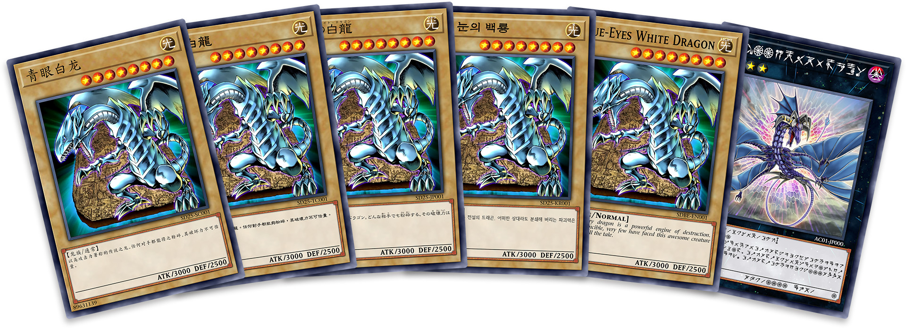

<h1 align="center">🎮 游戏王卡片生成器</h1>

<p align="center">
  <a href="https://www.npmjs.org/package/yugioh-card">
    
  </a>
  <a href="LICENSE">
    
  </a>
</p>

<p align="center">一个使用Canvas渲染经典游戏王卡片的工具，支持多种卡片类型和自定义选项</p>

<p align="center">
  
</p>

## ✨ 功能特点

- 🎨 完全自定义：卡名、属性、星级、攻防、效果文本等所有元素均可修改
- 🖼️ 图片上传：支持上传自定义卡图
- 📝 即时预览：修改参数实时更新卡片效果
- 💾 导出功能：一键导出高质量PNG图片
- 📱 响应式设计：适配不同屏幕尺寸

## 🚀 快速开始

### 在线体验

访问[在线演示](https://kooriookami.github.io/yugioh-card/)立即开始创建你的自定义游戏王卡片。

### 本地运行

```bash
# 克隆仓库
git clone https://github.com/kooriookami/yugioh-card.git

# 安装依赖
npm install

# 启动开发服务器
npm run dev
```

### 作为库使用

```bash
# 安装依赖
npm install yugioh-card
```

```javascript
import { YugiohCard } from 'yugioh-card';

// 创建卡片实例
const card = new YugiohCard({
  view: document.getElementById('card-container'), // 容器元素
  data: {
    // 卡片数据（见下方数据属性说明）
    name: '青眼白龙',
    type: 'monster',
    attribute: 'light',
    // ...其他属性
  },
  resourcePath: 'path/to/assets/yugioh-card', // 静态资源路径
});

// 导出图片
card.leafer.export('card.png');
```

## 📋 卡片类型与属性

### 基本属性（所有卡片通用）

| 属性名       | 说明     | 类型     | 可选值                          | 默认值 |
|:----------:|:-------:|:-------:|:------------------------------:|:-----:|
| language   | 语言     | enum    | 'sc'/'tc'/'jp'/'kr'/'en'/'astral' | 'sc'  |
| name       | 卡名     | string  | -                              | ''    |
| type       | 卡片类型  | enum    | 'monster'/'spell'/'trap'/'pendulum' | 'monster' |
| image      | 卡图     | string  | -                              | ''    |

### 怪兽卡属性

| 属性名       | 说明     | 类型     | 可选值                          | 默认值 |
|:----------:|:-------:|:-------:|:------------------------------:|:-----:|
| cardType   | 怪兽种类  | enum    | 'normal'/'effect'/'ritual'/'fusion'/'synchro'/'xyz'/'link' | 'normal' |
| attribute  | 属性     | enum    | 'dark'/'light'/'earth'/'water'/'fire'/'wind'/'divine' | 'dark' |
| level      | 星级     | number  | 0-12                           | 0     |
| rank       | 阶级     | number  | 0-13                           | 0     |
| monsterType| 种族/类型 | string  | -                              | ''    |
| atk        | 攻击力   | number  | -2-9999 (-1代表?，-2代表∞)        | 0     |
| def        | 防御力   | number  | -2-9999 (-1代表?，-2代表∞)        | 0     |
| arrowList  | 连接箭头 | array   | [0-8]                          | []    |

### 魔法/陷阱卡属性

| 属性名 | 说明   | 类型   | 可选值                                              | 默认值 |
|:----:|:-----:|:-----:|:--------------------------------------------------:|:-----:|
| icon | 图标   | enum  | 'equip'/'field'/'quick-play'/'ritual'/'continuous'/'counter' | ''    |

### 灵摆卡属性

| 属性名              | 说明       | 类型     | 可选值 | 默认值            |
|:-----------------:|:---------:|:-------:|:-----:|:----------------:|
| pendulumType      | 灵摆怪兽类型 | enum    | 多种组合 | 'normal-pendulum' |
| pendulumScale     | 灵摆刻度    | number  | 0-13  | 0                |
| pendulumDescription | 灵摆效果  | string  | -     | ''               |

### 效果文本与外观

| 属性名             | 说明       | 类型     | 可选值                | 默认值  |
|:----------------:|:---------:|:-------:|:--------------------:|:------:|
| description      | 效果描述    | string  | -                    | ''     |
| descriptionZoom  | 效果描述缩放 | number  | 0.5-1.5              | 1      |
| descriptionAlign | 效果描述居中 | boolean | -                    | false  |
| firstLineCompress| 首行压缩    | boolean | -                    | false  |
| package          | 卡包编号    | string  | -                    | ''     |
| password         | 卡片密码    | string  | -                    | ''     |
| copyright        | 版权       | enum    | 'sc'/'jp'/'en'       | ''     |
| rare             | 罕贵度     | enum    | 多种选项               | ''     |
| scale            | 卡片缩放    | number  | 0.5-2                | 1      |

## 🧩 组件结构

```
src/
├── assets/              # 静态资源
│   ├── demo/            # 示例数据
│   ├── image/           # 图片资源
│   └── yugioh-card/     # 卡片资源
├── components/          # 组件
│   └── YugiohCard.vue   # 卡片生成器组件
├── styles/              # 样式文件
├── App.vue              # 主应用组件
└── main.js              # 入口文件

packages/                # NPM包源码
└── yugioh-card/
    └── src/
        ├── card/        # 基础卡片类
        ├── yugioh-card/ # 游戏王卡片实现
        ├── utils/       # 工具函数
        └── index.js     # 导出文件
```

## 📄 许可证

[MIT License](LICENSE)

## 📧 联系方式

如有问题或建议，请提交 [Issue](https://github.com/kooriookami/yugioh-card/issues) 或联系开发者。
